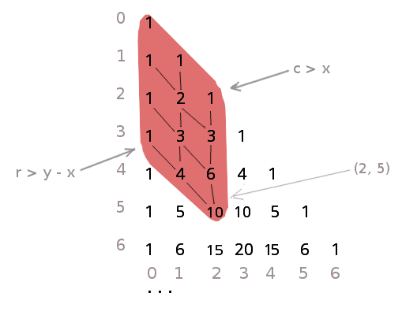

# Хвостовая рекурсия в треугольнике Паскаля


## Обратный подход
Начинать следует не от элемента `(x, y)`, а с вершины треугольника. Следующий ряд чисел из предыдущего порождает функция, устроенная таким образом:
* `next([1]) => []`
* `next([1, 2, 2, 1]) => [3, 4, 3]`

```scala
def nxt(l: List[Int], r: List[Int] = List()): List[Int] =
    if (l.length > 1)
        nxt(l.tail, (l(0) + l(1)) :: r)
    else
        r
```
Рекурсия в этой функции хвостовая.

## Добавление единиц
Каждый следующий ряд `r'` по сравнению с предыдущим рядом `r` имеет вид `r' = [1] ++ nxt(r) ++ [1]`, где единицы слева и справа прибавляются по правилам:
* справа, если номер текущей строки `r <= x`
* слева, если номер текущей строки `r <= y - x`

При наличии координат искомого элемента и текущих номера строки и очередного списока элементов, информации достаточно, чтобы свести весь результат к одному рекурсивному вызову, то есть рекурсия хвостовая.

```scala
def oneIf(cond : Boolean): List[Int] =
    if (cond) List(1) else List()

def pas(x: Int, y: Int, l: List[Int] = List(), r: Int = 1): Int =
    if (r <= y)
        pas(x, y, oneIf(r <= y - x) ++ nxt(l) ++ oneIf(r <= x), r + 1)
    else
        l(0)
```

## Пример вычисления
```
> pas(6, 13)

List(1)
List(1, 1)
List(1, 2, 1)
List(1, 3, 3, 1)
List(1, 4, 6, 4, 1)
List(1, 5, 10, 10, 5, 1)
List(1, 6, 15, 20, 15, 6, 1)
List(1, 7, 21, 35, 35, 21, 7)
List(28, 56, 70, 56, 28, 8)
List(36, 84, 126, 126, 84)
List(210, 252, 210, 120)
List(330, 462, 462)
List(924, 792)
List(1716)
```
